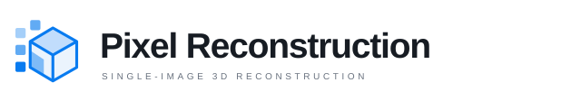
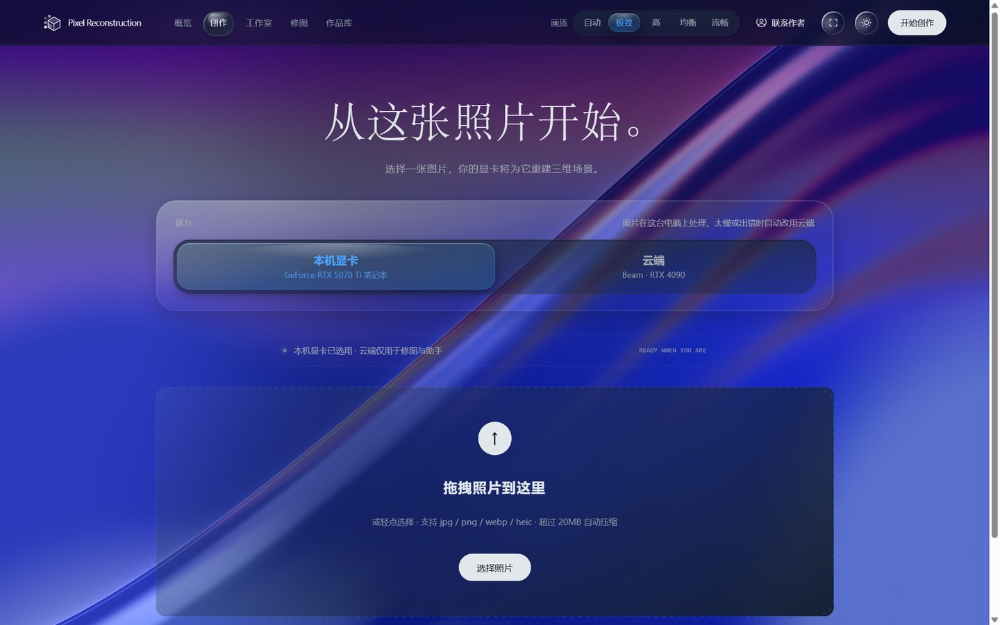
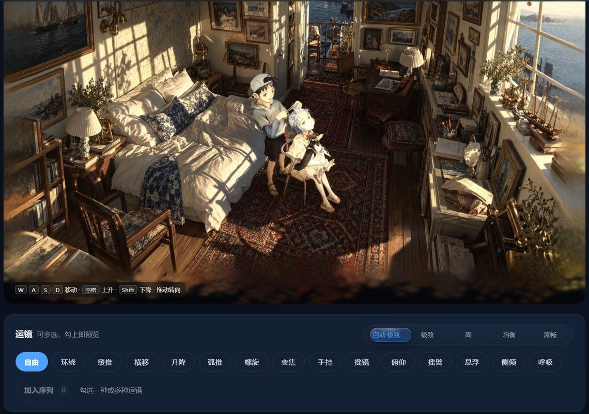
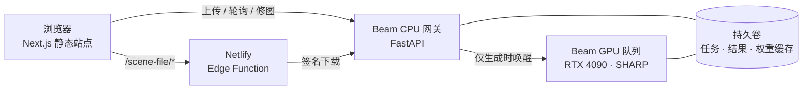

<div align="center">

<picture>
  <source media="(prefers-color-scheme: dark)" srcset="docs/images/wordmark-dark.svg">
  
</picture>

<p>把一张照片重建成可以在浏览器里走进去的 3D 场景。</p>

<p>
  <a href="https://pixel-reconstruction.netlify.app"></a>
</p>
<p>
  
  
  
  
  
</p>



</div>

<br>

重建使用 Apple 的 [SHARP](https://github.com/apple/ml-sharp) 模型，在云端 GPU 上完成单图推理，一次大约一分钟。查看、运镜和视频导出都在浏览器本地完成，不需要安装任何软件。

也可以使用 Windows 客户端（Windows 10/11，64 位）：[从网站下载](https://pixel-reconstruction.netlify.app/download/PixelReconstruction-Setup.exe) · [GitHub Releases](https://github.com/shihshdh/pixel-reconstruction/releases/latest)。客户端是一个独立窗口，内容和网站同步更新，说明见 [desktop/README.md](desktop/README.md)。

## 效果

<table>
  <tr>
    <td width="50%"></td>
    <td width="50%"></td>
  </tr>
  <tr>
    <td><b>显影</b><br>上传后，云端开始重建。等待时，照片以粒子形式由中心向外逐步聚合。</td>
    <td><b>工作室</b><br>在重建出的场景里自由移动，编排镜头序列，导出 MP4。</td>
  </tr>
</table>

<p align="center"></p>
<p align="center"><sub>页面右下角的助手会随时间更换道具与动作，也可以回答使用问题。</sub></p>

## 功能

| | |
| --- | --- |
| **重建** | 支持 JPG、PNG、WebP、HEIC，20MB 以内。首次唤醒 GPU 需要多等一会儿 |
| **查看** | 拖动转向，滚轮推拉；电脑上用 W/A/S/D 前后左右移动，空格上升，Shift 下降 |
| **运镜** | 14 种镜头轨迹，可以串成一条序列预览，再用 WebCodecs 在本地编码成 MP4 |
| **修图后重建** | 用自然语言调用豆包 Seedream 修图、扩图，满意后用新图重新生成场景 |
| **作品库** | 原图和场景保存在浏览器 IndexedDB 中，离线也能打开；下载支持断点续传 |
| **助手** | Live2D 形象，通过 DeepSeek 回答使用问题；用户同意后可以读取当前页面或截图 |

## 架构



- 只有“生成”和“重新生成”会唤醒 GPU。浏览、轮询、下载和修图都在 CPU 网关上处理。
- GPU 和 CPU 服务都配置为最少 0 个实例、不保温，没有请求时自动缩容。
- 每个任务有独立的随机 Token，服务端只保存哈希。文件通过 24 小时有效的签名链接下载。

接口和部署细节见 [backend/beam/README.md](backend/beam/README.md)。

## 目录

```
app/                     页面入口（Next.js App Router，静态导出）
components/              查看器、运镜、显影动画、助手等组件
lib/                     后端通信、下载与续传、作品库存储
backend/beam/            Beam 后端：CPU 网关、GPU worker、授权与签名、测试
backend/local_server.py  本地 GPU 后端（可选），说明见 backend/本地GPU指南.md
desktop/                 Windows 客户端（Tauri 2）
netlify/edge-functions/  场景文件转发
public/                  首页示例场景、演示视频、品牌素材、Live2D 模型
scripts/                 发布检查、部署辅助与浏览器验证脚本
docs/                    开发记录与文档图片
```

## 本地运行

需要 Node.js 20 或更高版本。

```sh
npm install
cp .env.local.example .env.local   # 填入 NEXT_PUBLIC_BEAM_API
npm run dev
```

然后打开 <http://localhost:3000>。

`NEXT_PUBLIC_BEAM_API` 是 CPU 网关的公开地址，会被打包进前端代码，所以这里只能填地址，不能填任何密钥。Beam Token、DeepSeek 和豆包的 Key 都放在 Beam Secrets 里，只在服务端使用。

如果有自己的 NVIDIA 显卡，也可以不用云端：按 `backend/本地GPU指南.md` 启动本地后端，然后在本地页面把后端切换到 `http://localhost:8000`。

## 部署

<details>
<summary><b>前端 · Netlify</b></summary>

```sh
npm run build                     # 输出到 out/
node scripts/check-release.cjs    # 检查发布包里有没有密钥或私有目录
netlify deploy --dir=out --prod
```

发布时要连同 `netlify/edge-functions/` 一起部署，只上传 `out/` 的静态文件是不够的。更换 CPU 网关地址时，要同时修改 `.env.local` 和 `netlify/edge-functions/scene-file.ts` 里写死的网关地址。

</details>

<details>
<summary><b>后端 · Beam</b></summary>

在 Linux 或 WSL 环境中安装 `beam-client` 并登录，然后在 `backend/beam/` 目录下执行：

```sh
beam deploy beam_app.py:gpu
beam deploy beam_app.py:api
```

需要配置哪些 Secrets、如何限制额度，见 [backend/beam/README.md](backend/beam/README.md)。

</details>

<details>
<summary><b>测试</b></summary>

```sh
npm run build                                                        # 类型检查与构建
python -m unittest discover -s backend/beam -p "test_*.py"           # 后端离线测试
```

</details>

## 已知限制

- 单张照片只包含一个视角的信息，被遮挡的部分无法可靠还原。转动角度太大时画面会穿帮，这不是 360° 重建。
- 作品库保存在浏览器本地，清理站点数据或使用隐私模式后会丢失。需要长期保留的作品请下载原始 PLY。
- 应用默认每天最多 30 次生成、30 次修图，这只是应用层的保护，不是账户的费用上限。费用以 Beam 和豆包的实际账单为准，可参考[开发记录](docs/开发记录.md)中的成本估算。
- 场景文件通常有几十 MB，网络慢时首次加载需要较长时间。

## 第三方组件与许可

- [SHARP](https://github.com/apple/ml-sharp)：Apple 的单图 3D 重建模型，代码和权重按其原始许可使用，本仓库不包含模型权重。
- [GaussianSplats3D](https://github.com/mkkellogg/GaussianSplats3D)：浏览器端高斯泼溅渲染。
- 助手形象：《DeepSeek 鲸鱼娘》Live2D 模型，作者 B 站 [@氵六青](https://space.bilibili.com/11272072)，按 CC BY-NC-SA 4.0 原样使用，不得用于商业用途，详见 `public/companion/whale/` 下的许可文件。
- Live2D Cubism Core（`public/companion/live2dcubismcore.min.js`）：Live2D Inc. 的专有软件，按其再分发条款随应用提供。

除上述第三方内容外，本仓库暂未指定开源许可证。
